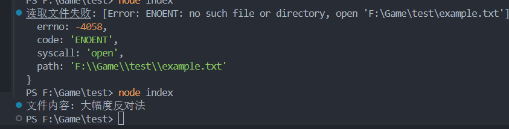

 # 📦 个人项目

 ### 1、功能
 #### 1、目的
 开发uniapp时遇到一个功能，一直往里问，闻到了node module 跨平台的一个实现， 简单学习实现一下。  
#### 2、 功能   

> *都还是十分简陋的功能，主要目的还是学习测试*     

文件打开  
摄像机   


 ### 2、目前效果
 经过了上传、下载测试，能够成功运行      
      
 
 

 ### 3、还没实现的尝试
 #### .node C\C++的文件
 npm install -g node-gyp   编译原生模块

 hello.cc是一个尝试，打算编译C\C++的二进制文件.node放进去，但是遇到了问题，先没弄。

 同理，binding.gyp也先忽略

 #### typescript 这个实现
TypeScript 是 JavaScript 的超集，必须先通过 tsc 编译为纯 JS，才能被 V8 执行。
TypeScript 在库开发中非常有用，因为它能生成类型声明文件（.d.ts），提供更好的开发体验。

### 4、涉及到技术
ESM,CJS   ？
如何发布自己的node包 ？
发布过程中，常见的问题以及解决【日志等】 ？
node install xxx, 下载过程中会做什么 ？
package-lock文件？

体会到了nodejs  js  package.json文件的作用 

## 5、日志
2024 12 9, 初次学习和提交    

# 🚀 安装
```
npm install my-apphxwx
```
# 📘 使用方法 
```js
const { getFile } = require('my-apphxwx');

getFile('./example.txt')
  .then(content => console.log('文件内容:', content))
  .catch(err => console.error('读取文件失败:', err));
```  

# 📄 许可证 (License)

MIT License - 免费开源，欢迎贡献！


[](https://www.npmjs.com/package/my-apphxwx)
[](https://github.com/snowcgj/MineNodeModules/blob/main/LICENSE)